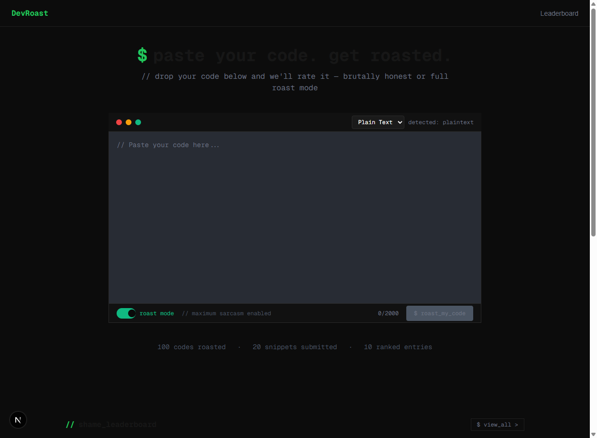
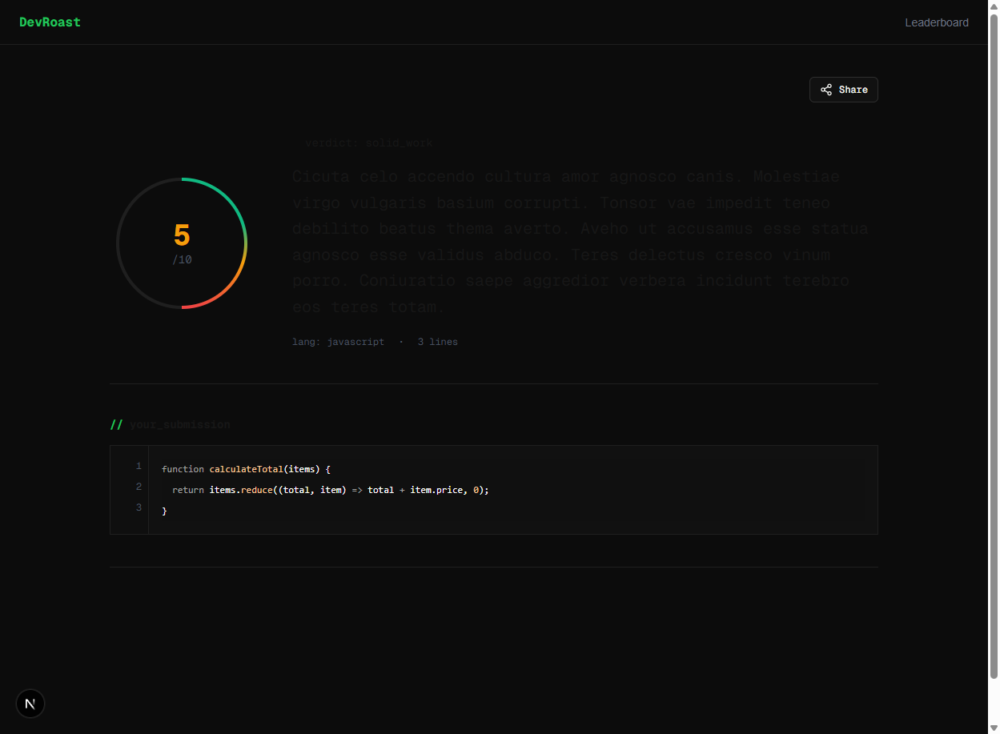
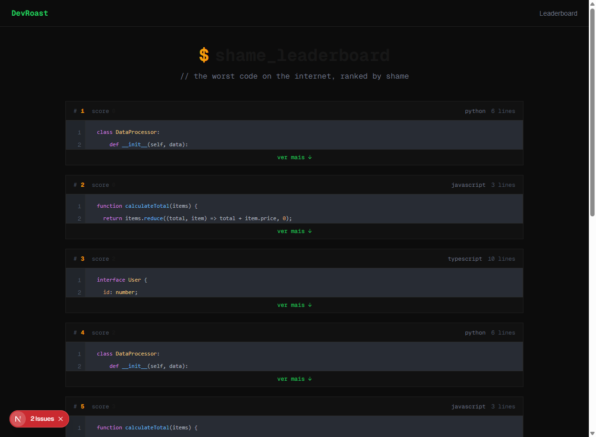

# DevRoast

<p align="center">
  
</p>

DevRoast é uma plataforma para desenvolvedores compartilharem snippets de código e serem "assados" pela comunidade. Cole seu código, receba uma análise brutalmente honesta e compartilhe os resultados!

## Funcionalidades

- **Compartilhamento de Código**: Cole seu código e receba uma análise instantânea powered by IA
- **Sistema de Roast**: Um sistema de pontuação 0-10 baseado na qualidade do código
- **Modo Serious/Roast**: Escolha entre feedback construtivo ou sarcasmo total
- **Análise Detalhada**: Veja issues, diffs e sugestões de melhoria
- **Leaderboard**: Confira os "piores" códigos do mês
- **OG Image**: Compartilhe resultados com preview automático para redes sociais

## Screenshots

### Página Inicial
<p align="center">
  
</p>

### Página de Resultado
<p align="center">
  
</p>

### Leaderboard
<p align="center">
  
</p>

## Stack Tecnológica

- **Framework**: Next.js 16 (App Router)
- **Linguagem**: TypeScript
- **Estilização**: Tailwind CSS v4
- **UI Components**: Base UI, Tailwind Variants
- **Banco de Dados**: PostgreSQL (Docker), Drizzle ORM
- **IA**: Google Gemini API
- **Linting**: Biome, ESLint
- **OG Images**: Takumi (Rust-based image generation)

## Como Executar

### Pré-requisitos

- Node.js 20+
- Docker (para PostgreSQL)

### Instalação

1. Clone o repositório:
```bash
git clone https://github.com/M-Fragata/devroast.git
cd devroast
```

2. Instale as dependências:
```bash
npm install
```

3. Configure o banco de dados:
```bash
docker-compose up -d
```

4. Copie o arquivo de ambiente e configure suas variáveis:
```bash
cp .env.example .env
# Edite o .env com suas credenciais (DATABASE_URL, GEMINI_API_KEY)
```

5. (Opcional) Popule o banco com dados de exemplo:
```bash
npm run db:seed
```

6. Inicie o servidor de desenvolvimento:
```bash
npm run dev
```

7. Acesse http://localhost:3000

## Scripts Disponíveis

| Script | Descrição |
|--------|-----------|
| `npm run dev` | Inicia o servidor de desenvolvimento |
| `npm run build` | Build para produção |
| `npm run lint` | Executa o linter |
| `npm run db:seed` | Popula o banco com dados de exemplo |

## Estrutura do Projeto

```
src/
├── app/
│   ├── api/           # API Routes (tRPC)
│   ├── components/    # Componentes React
│   │   └── ui/        # Componentes genéricos
│   ├── result/[id]/   # Página de resultado
│   └── page.tsx        # Página inicial
├── db/                # Schema e configuração do banco
├── lib/               # Utilitários e clientes
└── server/            # Lógica de servidor (tRPC)
```

## Licença

MIT
